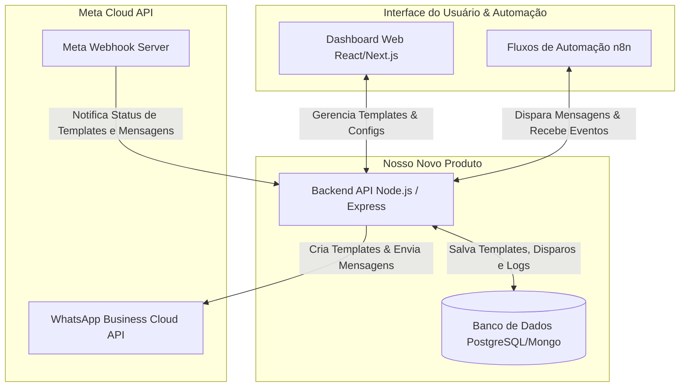
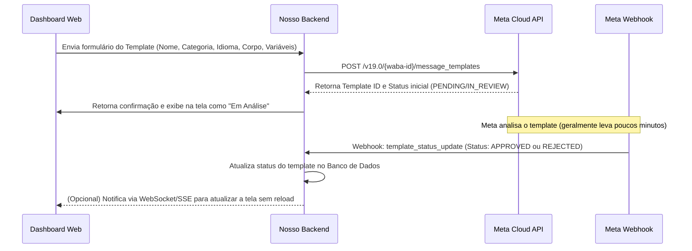
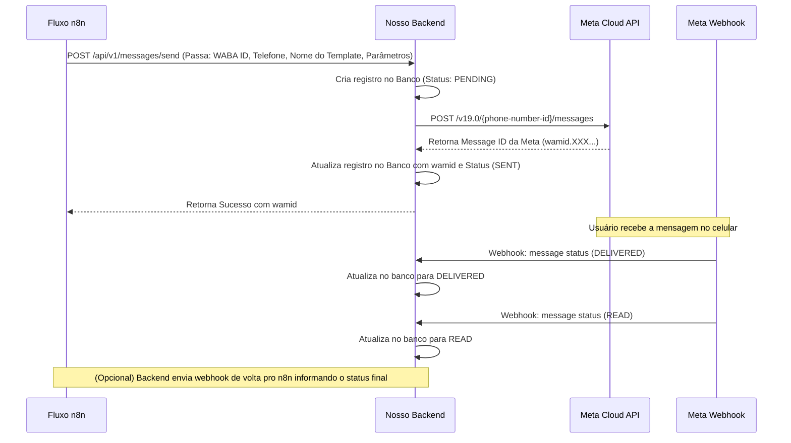

# Proposta de Arquitetura: Plataforma de Disparos API Oficial Meta (WhatsApp)

Esta proposta descreve como estruturar e desenvolver um produto próprio para cadastro de templates, controle de aprovação na Meta, disparo de mensagens e acompanhamento de status em tempo real, integrado com o **n8n** para automações.

---

## 🗺️ Visão Geral da Arquitetura

Para criar esse produto de forma independente do CRM Growhats, precisamos de três pilares principais:
1. **Frontend (Dashboard)**: Para gerenciar templates, credenciais da Meta, ver relatórios de disparos e status.
2. **Backend (API Intermediária)**: Para abstrair a complexidade da API da Meta, criptografar tokens, gerenciar filas de disparos e processar Webhooks.
3. **Integração com n8n**: O n8n atuará como o motor de regras de negócio e automação, disparando as mensagens através da nossa API e reagindo aos eventos de status (ex: entregue, lido, falhou).

### Fluxo de Dados e Componentes



---

## 🛠️ Detalhamento dos Componentes

### 1. Backend & Banco de Dados (O Coração da Plataforma)
O backend atuará como um middleware seguro entre o seu frontend/n8n e a Meta Cloud API.

* **Por que uma API própria e não chamar a Meta direto no n8n?**
  * **Segurança**: Guardar os Tokens de Acesso de Sistema (Permanent Access Tokens) em banco de dados de forma criptografada.
  * **Controle de Rate Limit**: A Meta possui limites de requisições por segundo. Nosso backend pode gerenciar filas (ex: usando Redis/BullMQ) se houver disparos em massa.
  * **Padronização**: O n8n fará chamadas simples como `POST /api/v1/send` e o backend tratará de montar o JSON complexo exigido pela Meta.
  * **Tratamento de Webhooks**: A Meta envia webhooks de entrega muito rápidos. Processar tudo diretamente no n8n pode sobrecarregá-lo ou dificultar a persistência histórica.

* **Banco de Dados Recomendado**:
  * **PostgreSQL**: Excelente para relatórios relacionais (templates vinculados a contas, logs de mensagens com status, etc.).
  * **Tabelas Principais**:
    * `accounts`: Credenciais da Meta (WABA ID, Phone ID, Access Token criptografado).
    * `templates`: Dados do template (nome, idioma, categoria, status da Meta: PENDING/APPROVED/REJECTED, componentes).
    * `messages`: Registro de cada disparo (`message_id` da Meta, telefone destino, template usado, status atual: `sent`, `delivered`, `read`, `failed`, e timestamps).

---

## 🔄 Fluxos de Negócio Detalhados

### Fluxo A: Cadastro e Aprovação de Templates
Os templates de mensagens do WhatsApp precisam ser criados e aprovados pela Meta antes de serem enviados.



### Fluxo B: Disparo de Mensagem via n8n & Atualização de Status
Aqui vemos como o n8n se integra para realizar automações de forma robusta.



---

## ⚡ Como Integrar com o n8n na Prática?

Existem duas formas principais de conectar o seu novo produto com o n8n:

1. **n8n como Disparador (Trigger)**:
   * No n8n, você usará o nó **HTTP Request** apontando para a sua API interna:
     ```bash
     POST https://sua-api.com/api/v1/messages/send
     Headers:
       Authorization: Bearer <seu-token-interno>
     Body:
       {
         "to": "5511999999999",
         "template_name": "boas_vindas",
         "language": "pt_BR",
         "variables": ["Pedro", "Cupom10"]
       }
     ```
2. **n8n como Receptor de Eventos (Webhooks Retornos)**:
    * Se você quiser que o n8n tome ações baseado no status da mensagem (ex: se der `failed` enviar um SMS ou notificar o vendedor), você pode configurar em sua plataforma uma URL de Webhook do n8n para cada conta de cliente.
    * Quando o backend receber o status da Meta, ele faz um repasse (webhook forwarding) para o n8n.

---

## 📈 Extensões e Melhorias Arquiteturais (Fase de Produção)

### A. Carregamento sob Demanda de Bibliotecas Extras (Excel/SheetJS)
Para manter o bundle React inicial leve, o processamento de planilhas Excel `.xlsx` ocorre no frontend carregando a biblioteca do CDN de forma assíncrona. Quando o usuário ativa a importação via Excel, o frontend aciona um injetor dinâmico de script que adiciona a biblioteca ao DOM e resolve a Promise com o leitor XLSX em tempo de execução.

### B. Gestão de Agendamentos Futuros com SSE (Server-Sent Events)
Disparos agendados no futuro são salvos com status `PENDING` e `scheduledAt` correspondente.
- O backend expõe endpoints REST para listagem (`GET /accounts/:accountId/scheduled`), cancelamento (`DELETE`) e reagendamento (`POST .../reschedule`).
- Quando um agendamento é alterado ou cancelado, o backend emite eventos via barramento de eventos local (`messageEventEmitter`). A conexão aberta de **Server-Sent Events (SSE)** encaminha o status atualizado em tempo real para os navegadores dos clientes, que recarregam a lista automaticamente de forma reativa.

### C. Sincronização Unificada de Listas e Contatos (PUT RESTful)
Para viabilizar a edição e gerenciamento completo de listas de contatos sem gerar dezenas de requisições de rede individuais, a arquitetura utiliza um endpoint transacional unificado:
`PUT /accounts/:accountId/lists/:listId`
1. O backend atualiza o nome da lista de contatos.
2. Compara os contatos recebidos com os já persistidos no banco.
3. Executa em lote: exclusões de contatos ausentes (`deleteMany`), criações de contatos inéditos (`createMany`) e atualizações de registros alterados (`update`).

---

## 🚀 Próximos Passos para o Desenvolvimento

Para tirarmos esse projeto do papel, podemos começar de forma ágil com a seguinte trilha:

1. **Configurar o Ambiente na Meta**:
   * Criar um aplicativo de negócios no portal [Meta for Developers](https://developers.facebook.com/).
   * Configurar o produto do WhatsApp.
   * Gerar um Token de Acesso Temporário para testar chamadas básicas via Postman ou cURL.
2. **Desenvolver o Backend MVP**:
   * Criar uma API em Node.js (TypeScript/Express) com endpoints de:
     * Enviar template (`POST /api/templates`).
     * Listar templates (`GET /api/templates` buscando direto da API da Meta ou do nosso banco sincronizado).
     * Enviar mensagem utilizando template (`POST /api/messages/send`).
     * Receber o Webhook da Meta (`POST /api/webhooks/whatsapp`) para processar as atualizações de mensagens e templates.
3. **Desenvolver o Frontend (Dashboard)**:
   * Interface limpa e intuitiva para gerenciar templates (exibindo se estão aprovados, rejeitados ou pendentes).
   * Tela para envio manual de mensagens unitárias para testes.
   * Dashboard gráfico simples com taxas de entrega, leitura e falhas.
4. **Acoplar o n8n**:
   * Criar um workflow de teste no n8n que faça chamadas para o nosso backend MVP.

---

> [!TIP]
> **Dica de Monetização / Produto (SaaS):**
> Se no futuro você quiser vender este produto como um SaaS (Software as a Service) multitenant, o backend já desenhado com a tabela `accounts` permitirá que cada cliente configure suas próprias credenciais da Meta, permitindo que você cobre uma assinatura deles pelo uso do painel e controle de disparos.
